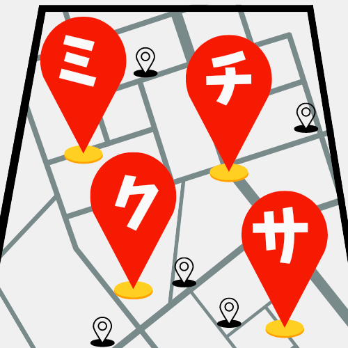

# プロダクト名
ミチクサ

## チーム名
チームG C.A.C..zip

## 背景・課題・解決されること
有名な観光地が過密になることから、移動を通じて人の分散ができないかを考えた。 
目的地までのミチクサ（寄り道）を提案することで分散を図る。

## プロダクト説明
出発地と目的地、ミチクサスポットのジャンルを指定するとミチクサルートを提案する

## 注力したポイント
ルートの提示を（Google Mapの二番煎じにならないために）できるように全力を注ぎました。

## 使用技術
- Flutter
- Google Map API
